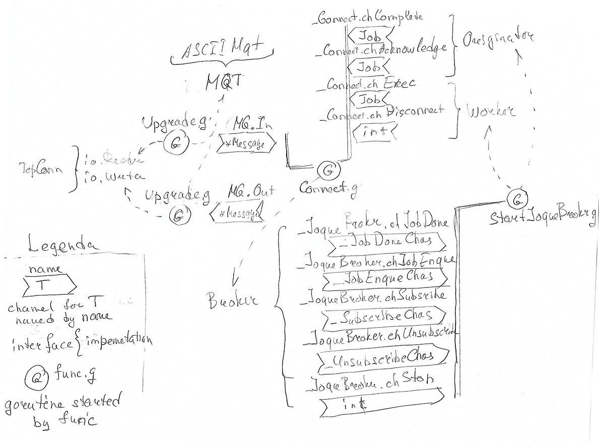

## Terms

__Joque__ - the queuing job broker mediating between job originators and workers.   
   The queueing broker is coded in Go. Client API has Python interface.
   
__Originator__ - the source of job instructions

__Worker__ - the service subscribed on topic and executes job instructions

__Job__ - some instructions how to do a job.    
   The broker does not have a business with instructions, only with jobs as objects to queueing, passing them to workers and returning result to originators, if it is required.

__Topic__ - the rendezvous point where meet originator, worker and job queue.

__Queue__ - the queue of jobs. 

__QoS__ - the quality of service level.   
   Every job declares required QoS. There are three levels: QosRelax, QosAck, QosComplete. QosRelax means originator does not warry about acknoladgments. It does likes fire and forget. QosAck - Originator requires acknoladgment when job enqueueued. QosComplete - originator requires job result or acknoladgment when jobe is done.
   
__Priority__  - the job priority.   
   Every job declares self priority . There are three levels: PriorityHigh, PriorityNormal,PriorityLow.
   
__TTL__  - the time to live.   
   Every job declares how many times it can be reenqueued if worker failed to execute it.
   
## The main actors and their connections


   
The main actor is a goroutine starting in function [_broker.StartJoqueBroker_](https://github.com/sudachen/joque/blob/master/go/broker/jqbroker.go#L311). This goroutine handle job enqueueing, worker subscribing, applying jobs to workers and forwarding results to job originators. 

For every client (both origionator and worker) server starts three goroutines. Two of them are started by function [_transport.Upgrade_](https://github.com/sudachen/joque/blob/master/go/transport/transport.go#L72) to upgrate tcp connection upto message queue. They handle translation between raw bytes on the tcp connection and their representation in the structure [_transport.Message_](https://github.com/sudachen/joque/blob/master/go/transport/transport.go#L28). To translate messages they use transport [_transport.ASCIIMqt_](https://github.com/sudachen/joque/blob/master/go/transport/asciimqt.go#L15). The third goroutine is started by function [_server.Connect_](https://github.com/sudachen/joque/blob/master/go/server/connect.go#L40). The function [_server.Connect_](https://github.com/sudachen/joque/blob/master/go/server/connect.go#L40) connects message queue with broker. The goroutine handle the client logic regarding to managing job and their results in both originator and worker cases. 

## Broker (Golang)

The broker divided into three packages: 

* The [_broker package_](https://github.com/sudachen/joque/tree/master/go/broker) contains [_broker interfaces_](https://github.com/sudachen/joque/blob/master/go/broker/broker.go) and function [_StartJoqueBroker_](https://github.com/sudachen/joque/blob/master/go/broker/jqbroker.go#L311).
* The [_transport package_](https://github.com/sudachen/joque/tree/master/go/transport) contains simple ASCII messaging transport [_ASCIIMqt_](https://github.com/sudachen/joque/blob/master/go/transport/asciimqt.go#L15) and function [_Upgrade_](https://github.com/sudachen/joque/blob/master/go/transport/transport.go#L72).
* The [_server package_](https://github.com/sudachen/joque/tree/master/go/server) contains functions [_Connect_](https://github.com/sudachen/joque/blob/master/go/server/connect.go#L40) and [_StartJoqueServer_](https://github.com/sudachen/joque/blob/master/go/server/server.go#L28)

## API (Python)

There is only one module [_joque_](https://github.com/sudachen/joque/blob/master/py/joque.py).

The worker code looks like

```python
from joque import Joque

jq = Joque('topic1')

@jq.Job(QoS=jq.QosRelax)
def hello(text):
    print(text)


@jq.Job()
def upper(text):
    return str(text).upper()


@jq.Job()
def rise_expt(text):
    raise Exception(text)

def serve(*args, **kw):
    jq.start(__file__, *args, **kw)


if __name__ == '__main__':
    jq.serve()
```

Jobs can be used in following maner

```python
from joque import Joque

Joque.set_broker("localhost:9100")

# workers can be started just here or on other pc
topic1.serve()

topic1.hello("hello world!")
s = topic1.upper("text").result()
```

